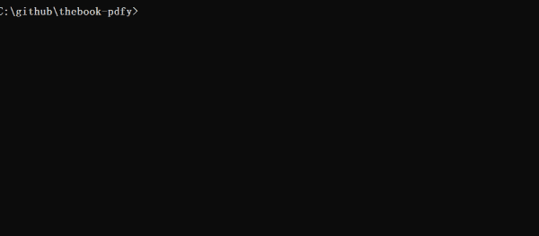

# thebook-pdfy
> 더북(thebook.io) 공개책 pdf로 저장하기

[](https://www.npmjs.com/package/thebook-pdfy)

## Install
```sh
npm i -g thebook-pdfy
```

#### without Install
```sh
npx thebook-pdfy
```

## Requirement
- Node 11
- Chrome (PC에 설치된 크롬 API를 사용합니다)

## CLI
```sh
Usage
    $ thebook-pdfy <?bookId|bookUrl>

Options
    --all, -a   Pdfy all the books.
    --dir, -d   Directory to save.
    --preview - p  Preview book with pdfy.
    --file-name -f
    --concurrency, -c
    --overwrite, -o

Examples
    $ thebook-pdfy
    $ thebook-pdfy 006982
    $ thebook-pdfy https://thebook.io/006982
    $ thebook-pdfy --all
```
### Interactive mode


## License
MIT
